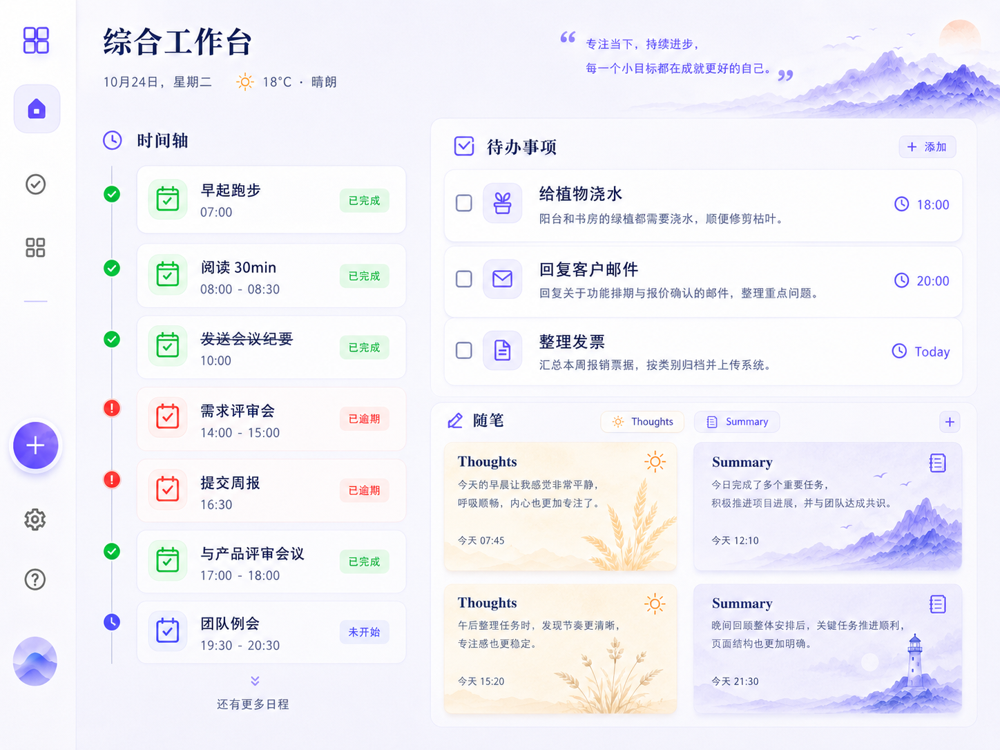

## 主面板

### 概览

核心是三个模块: 时间轴、待办事项、随笔

### 待办事项

核心字段说明:
- title: 标题
- detail: 细节, 详情
- 截止时间: 默认是23:59
- 是否完成

页面说明:
- 该列只显示未完成、未超时的待办事项

### 时间轴

`日程`核心字段说明
- title: 标题
- detail: 细节, 详情
- 开始时间
- 结束时间
- 是否完成

时间轴卡片类型: (判断变量: 当前时间)
- 未开始日程: 蓝色
- 已完成日程、已完成待办: 绿色、删除线
- 超时日程、超时待办: 红色

补充说明:
- 只有已完成和超时的待办会插入到时间轴
- 日程和待办的卡片要有细节区分

### 随笔
包含title和内容

